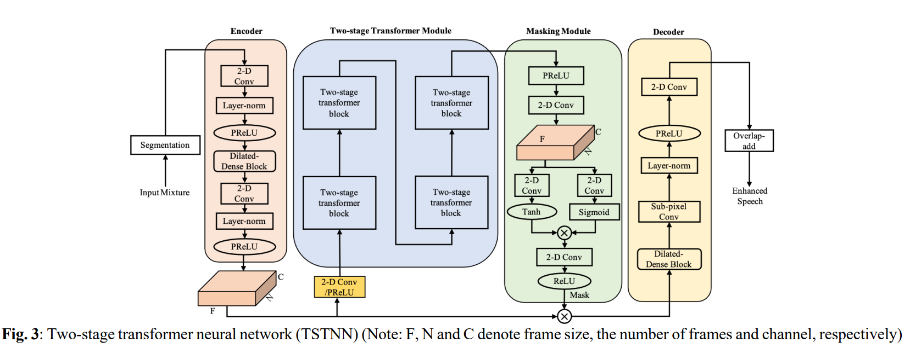
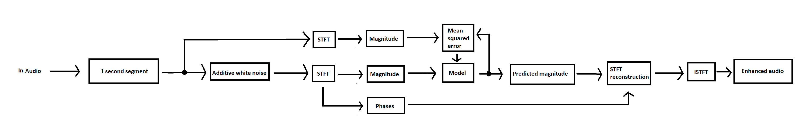

# Noise reduction speech enhancement

This repository contains code for audio speech enhancement. The model this
repository uses is based on [TSTNN: Two-stage Transformer based Neural Network for Speech Enhancement in the Time Domain](https://arxiv.org/abs/2103.09963) paper. The model architecture is described in the paper
and there is a image on page 3 which is the following

 
The code for the model is based on [Kai Wangs TSTNN repository](https://github.com/key2miao/TSTNN) of the article.
Some slight alterations were done, for example in the original model a spectrogram was input and reconstructed
audio was ouput. In this project the model was done so that it inputs a spectrogram and outputs also a spectrogram.

The architecture of the whole project is in the following image

Audio is segmented into 1 second segments which get added white noise after which STFT is calculated and its
magnitudes is given for the model. The model estimates the clean magnitudes and those are used to 
reconstruct the STFT using the noisy STFTs phases. After STFT reconstruction we can just calculate
the ISTFT and retrieve the enhanced audio.

## Features

Training of the model is done with [LibriSpeech dataset](https://www.openslr.org/12). Just download what
you want and add them into folders LibriSpeech and LibriSpeechTest in the root directory. Then run
the [create_features.py](create_features.py) file to create features. There is parameters which can be edited if different there is different location of the files. 

## Model
Model is in [Net.py](model/Net.py) file. The amount of channels in the model is hardcoded to 64 currently and the 
input channels to 1 and output channels to 1.

## Training
Using [training.py](training.py) the model can be trained. On line 70 there is this limiter for training
data per epoch because it takes way too long to train the model if all of the LibriSpeech data is used.
With the current 15000 amount of samples per epoch took around 10 hours to teach.

## Evaluation

Evaluation is done comparing the [speechbrain's sepformer](https://huggingface.co/speechbrain/sepformer-whamr16k) to this projects model.

[eval.py](eval.py) contains all evaluation of the model. The functions must be run as is in the file
name == main section, because actually the transform_and_evaluate function creates the noisy, clean and estimated files. And the do_speechbrain_estimation uses the noisy files so the transform_and_evaluate must be run before.
After which the save mel spectrograms can be run because then we have all the needed audiofiles to be able to draw
the spectrograms.

Currently in this repository in sourcehats there is

* clean speech in `actual.flac` files,
* noisy speech in `with_noise.flac` files
* this project model's estimated audios from the noisy speech in `estimated_from_noisy.flac`
* Speechbrain's sepformers estimated audios from the noisy speech in `estimated_from_noisy_speechbrain.flac`

The number in the folder name corresponds to the randomly picked test sample, so it does not mean anything.